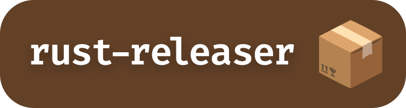

    

<!--  -->

<!--  -->
<!--  -->

Release automation for Rust projects. The missing [`goreleaser`](https://goreleaser.com) for Rust.

## Features

- [ ] Platforms support
  - [x] Linux
  - [x] MacOS
  - [ ] Windows
- [x] Building via `cargo` and `cross`
- [x] Publishing
  - [x] [GitHub](https://github.com)
  - [x] [Homebrew](https://brew.sh)
  - [x] [crates.io](https://crates.io)
  - [ ] [Snapcraft](https://snapcraft.io)
  - [ ] [winget](https://winget.run) 
  - [ ] [DockerHub](https://hub.docker.com)
  - [ ] HTTP upload
  - [ ] [S3](https://aws.amazon.com/s3)
- [ ] Changelog generation

